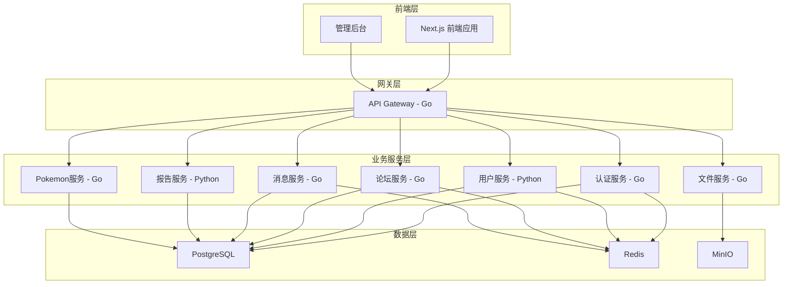

<div align="center">
  
  
  # 🏔️❄️ 落雪公会管理系统
  
  **Pokemon Snowfall Guild Management System**
  
  [](https://nextjs.org/)
  [](https://reactjs.org/)
  [](https://www.typescriptlang.org/)
  [](https://golang.org/)
  [](https://www.python.org/)
  [](https://fastapi.tiangolo.com/)
  [](https://www.postgresql.org/)
  [](https://redis.io/)
  [](https://www.docker.com/)
  [](https://choosealicense.com/licenses/mit/)
  
  一个现代化的宝可梦公会管理系统，采用前后端分离的微服务架构，支持模块化扩展和高并发处理。
  
  [🚀 快速开始](#-快速开始) • [📖 文档](#-项目结构) • [🛠️ 技术栈](#-技术栈) • [🤝 贡献](#-贡献指南)
  
</div>

---

## ✨ 功能特性

### 🎯 核心功能
- **🔐 认证授权系统**: JWT认证、角色权限管理、二次验证
- **👥 用户管理**: 用户档案、好友系统、活动记录
- **💬 论坛系统**: 帖子管理、实时评论、精灵租借
- **📨 消息通知**: 站内信、实时推送、邮件通知
- **📊 数据分析**: 会员统计、报表生成、数据可视化
- **🎮 Pokemon数据**: 10,000+ 宝可梦信息、技能道具数据
- **📁 文件管理**: 图片上传、文件存储、CDN集成
- **⚙️ 系统管理**: 后台管理、监控告警、日志分析

### 🏗️ 架构特性
- **🔄 微服务架构**: Go + Python 混合微服务
- **📦 模块化设计**: 前端组件自动注册和加载
- **🚀 高性能**: 支持1000+并发用户
- **🔒 安全可靠**: 完整的安全防护和数据保护
- **📈 可扩展**: 水平扩展和负载均衡支持
- **🐳 容器化**: Docker + Kubernetes 部署

## 🚀 快速开始

### 📋 环境要求

#### 前端环境
- **Node.js**: 18.0+ 
- **pnpm**: 8.0+
- **TypeScript**: 5.0+

#### 后端环境
- **Go**: 1.21+
- **Python**: 3.11+
- **uv**: Python包管理器
- **PostgreSQL**: 15+
- **Redis**: 7.0+

### 🔧 本地开发

#### 1. 克隆项目
```bash
git clone https://github.com/your-org/pokemon-snowfall-guild.git
cd pokemon-snowfall-guild
```

#### 2. 启动前端
```bash
# 安装依赖
pnpm install

# 启动开发服务器
pnpm dev
```

#### 3. 启动后端服务

**API网关 (Go)**
```bash
cd backend/gateway
go mod tidy
go run cmd/main.go
```

**用户服务 (Python)**
```bash
cd backend/services/user-service
uv sync
uv run uvicorn app.main:app --reload --port 8001
```

**认证服务 (Go)**
```bash
cd backend/services/auth
go mod tidy
go run cmd/main.go
```

#### 4. 访问应用
- **前端应用**: http://localhost:3000
- **API网关**: http://localhost:8080
- **用户服务文档**: http://localhost:8001/docs
- **报告服务文档**: http://localhost:8002/docs

### 🐳 Docker 部署

```bash
# 启动完整环境
docker-compose up -d

# 仅启动数据库服务
docker-compose up -d postgres redis
```

## 📁 项目结构

```
PokemonSnowfallGuild/
├── 📁 frontend/                    # 前端应用
│   ├── 📁 src/
│   │   ├── 📁 app/                # Next.js App Router
│   │   │   ├── 📄 layout.tsx     # 根布局组件
│   │   │   ├── 📄 page.tsx       # 首页组件
│   │   │   ├── 📁 admin/         # 管理后台页面
│   │   │   ├── 📁 forum/         # 论坛页面
│   │   │   ├── 📁 messages/      # 消息页面
│   │   │   └── 📁 profile/       # 用户资料页面
│   │   ├── 📁 components/        # 组件目录
│   │   │   ├── 📁 admin/         # 管理组件
│   │   │   ├── 📁 auth/          # 认证组件
│   │   │   ├── 📁 forum/         # 论坛组件
│   │   │   ├── 📁 messages/      # 消息组件
│   │   │   ├── 📁 modules/       # 功能模块
│   │   │   ├── 📁 reports/       # 报表组件
│   │   │   └── 📁 ui/            # UI基础组件
│   │   ├── 📁 contexts/          # React上下文
│   │   ├── 📁 hooks/             # 自定义Hooks
│   │   ├── 📁 lib/               # 工具库
│   │   ├── 📁 types/             # TypeScript类型
│   │   └── 📁 utils/             # 工具函数
│   ├── 📁 public/                # 静态资源
│   │   ├── 📁 imgs/              # 图片资源 (100张)
│   │   ├── 📁 thumbnails/        # 缩略图
│   │   ├── 📄 pokedex.yaml       # 宝可梦数据 (649种)
│   │   ├── 📄 moves.yaml         # 技能数据 (5000+)
│   │   ├── 📄 items.yaml         # 道具数据 (4000+)
│   │   └── 📄 types.yaml         # 属性数据
│   ├── 📄 package.json           # 前端依赖
│   ├── 📄 next.config.ts         # Next.js配置
│   └── 📄 tailwind.config.js     # Tailwind配置
├── 📁 backend/                    # 后端微服务
│   ├── 📁 gateway/               # API网关 (Go)
│   │   ├── 📁 cmd/               # 主程序入口
│   │   ├── 📁 internal/          # 内部业务逻辑
│   │   ├── 📁 pkg/               # 可复用包
│   │   ├── 📁 configs/           # 配置文件
│   │   └── 📄 go.mod             # Go模块文件
│   ├── 📁 services/              # 微服务集合
│   │   ├── 📁 auth/              # 认证服务 (Go)
│   │   ├── 📁 user-service/      # 用户服务 (Python/FastAPI)
│   │   ├── 📁 forum/             # 论坛服务 (Go)
│   │   ├── 📁 message/           # 消息服务 (Go)
│   │   ├── 📁 report-service/    # 报告服务 (Python/FastAPI)
│   │   ├── 📁 pokemon-service/   # 宝可梦数据服务 (Go)
│   │   └── 📁 file-storage/      # 文件存储服务 (Go)
│   ├── 📁 shared/                # 共享代码
│   │   ├── 📁 proto/             # Protocol Buffers
│   │   ├── 📁 config/            # 共享配置
│   │   ├── 📁 utils/             # 工具函数
│   │   └── 📁 types/             # 共享类型
│   ├── 📁 deployments/           # 部署配置
│   │   ├── 📄 docker-compose.yml # Docker编排
│   │   └── 📁 k8s/               # Kubernetes配置
│   └── 📁 scripts/               # 构建脚本
├── 📄 README.md                  # 项目文档
├── 📄 LICENSE                    # 开源协议
├── 📄 后端需求.md                # 后端需求文档
└── 📄 backend_architecture_report.md # 架构报告
```

## 🏗️ 系统架构

### 🔄 微服务架构



### 📦 前端模块化系统

#### 模块自动注册
```typescript
import { Module } from '@/lib/moduleLoader';

function MyNewModule() {
  return (
    <div>
      {/* 模块内容 */}
    </div>
  );
}

export default Module({
  id: 'my-new-module',
  name: '我的新模块',
  position: 'main', // 或 'sidebar'
  order: 3
})(MyNewModule);
```

#### 特性
- ✅ **自动注册**: 装饰器模式自动注册
- ✅ **位置控制**: main/sidebar 布局
- ✅ **排序支持**: order 属性控制顺序
- ✅ **热重载**: 开发时自动更新
- ✅ **类型安全**: 完整 TypeScript 支持

## 🛠️ 技术栈

### 🎨 前端技术

| 技术 | 版本 | 用途 | 官网 |
|------|------|------|------|
| **Next.js** | 15.4.1 | React全栈框架 | [nextjs.org](https://nextjs.org/) |
| **React** | 19.1.0 | 用户界面库 | [react.dev](https://react.dev/) |
| **TypeScript** | 5.0+ | 类型安全语言 | [typescriptlang.org](https://www.typescriptlang.org/) |
| **Tailwind CSS** | 4.0 | 原子化CSS框架 | [tailwindcss.com](https://tailwindcss.com/) |
| **Framer Motion** | 12.23.6 | 动画库 | [framer.com/motion](https://www.framer.com/motion/) |
| **Recharts** | 3.1.0 | 图表库 | [recharts.org](https://recharts.org/) |
| **Radix UI** | Latest | 无障碍UI组件 | [radix-ui.com](https://www.radix-ui.com/) |
| **Lucide React** | 0.525.0 | 图标库 | [lucide.dev](https://lucide.dev/) |

### ⚙️ 后端技术

#### Go 服务
| 技术 | 版本 | 用途 | 官网 |
|------|------|------|------|
| **Go** | 1.21+ | 系统编程语言 | [golang.org](https://golang.org/) |
| **Gin** | 1.9.1 | Web框架 | [gin-gonic.com](https://gin-gonic.com/) |
| **GORM** | 1.25.5 | ORM框架 | [gorm.io](https://gorm.io/) |
| **JWT** | 5.2.0 | 身份认证 | [jwt.io](https://jwt.io/) |
| **WebSocket** | 1.5.1 | 实时通信 | [gorilla/websocket](https://github.com/gorilla/websocket) |
| **Viper** | 1.17.0 | 配置管理 | [github.com/spf13/viper](https://github.com/spf13/viper) |

#### Python 服务
| 技术 | 版本 | 用途 | 官网 |
|------|------|------|------|
| **Python** | 3.11+ | 编程语言 | [python.org](https://www.python.org/) |
| **FastAPI** | 0.104+ | 现代Web框架 | [fastapi.tiangolo.com](https://fastapi.tiangolo.com/) |
| **SQLAlchemy** | 2.0.23 | Python ORM | [sqlalchemy.org](https://www.sqlalchemy.org/) |
| **Pydantic** | 2.5.0 | 数据验证 | [pydantic.dev](https://pydantic.dev/) |
| **Pandas** | 2.1.0 | 数据分析 | [pandas.pydata.org](https://pandas.pydata.org/) |
| **Celery** | 5.3.4 | 异步任务队列 | [celeryproject.org](https://celeryproject.org/) |

### 🗄️ 数据存储

| 技术 | 版本 | 用途 | 官网 |
|------|------|------|------|
| **PostgreSQL** | 15+ | 主数据库 | [postgresql.org](https://www.postgresql.org/) |
| **Redis** | 7.0+ | 缓存/会话存储 | [redis.io](https://redis.io/) |
| **MinIO** | Latest | 对象存储 | [min.io](https://min.io/) |
| **Elasticsearch** | 8.11+ | 搜索引擎 | [elastic.co](https://www.elastic.co/) |

### 🚀 DevOps & 部署

| 技术 | 版本 | 用途 | 官网 |
|------|------|------|------|
| **Docker** | Latest | 容器化 | [docker.com](https://www.docker.com/) |
| **Kubernetes** | 1.28+ | 容器编排 | [kubernetes.io](https://kubernetes.io/) |
| **Prometheus** | 2.45.0 | 监控系统 | [prometheus.io](https://prometheus.io/) |
| **Grafana** | 10.0.0 | 可视化面板 | [grafana.com](https://grafana.com/) |
| **Jaeger** | 1.50 | 链路追踪 | [jaegertracing.io](https://www.jaegertracing.io/) |

### 📊 数据规模

- **🎮 宝可梦数据**: 649+ 种宝可梦信息
- **⚔️ 技能数据**: 5,000+ 技能招式
- **🎒 道具数据**: 4,000+ 游戏道具
- **🖼️ 图片资源**: 100+ 高质量图片
- **👥 用户支持**: 1,000+ 并发用户

## 🤝 贡献指南

1. Fork 本仓库
2. 创建功能分支 (`git checkout -b feature/AmazingFeature`)
3. 提交更改 (`git commit -m 'Add some AmazingFeature'`)
4. 推送到分支 (`git push origin feature/AmazingFeature`)
5. 开启 Pull Request

## 📄 开源协议

### 🔓 MIT License

本项目采用 **MIT 许可证**，这是一个宽松的开源协议，允许：

- ✅ **商业使用** - 可用于商业项目
- ✅ **修改** - 可以修改源代码
- ✅ **分发** - 可以分发原始或修改版本
- ✅ **私人使用** - 可以私人使用
- ✅ **专利使用** - 提供专利授权

### 📋 协议要求

- 📝 **保留版权声明** - 必须包含原始版权和许可声明
- 📄 **包含许可证** - 分发时必须包含 MIT 许可证副本

### 🤔 为什么选择 MIT？

1. **🌍 广泛采用** - 最受欢迎的开源协议之一
2. **🚀 简单明了** - 条款简洁，易于理解
3. **🤝 友好兼容** - 与其他开源协议兼容性好
4. **💼 商业友好** - 允许商业使用和闭源衍生
5. **🔧 技术中立** - 不限制技术栈和使用场景

### 📜 完整协议

查看 [LICENSE](LICENSE) 文件了解完整的协议条款。

## 🙏 致谢

- 这个玩意真的有必要致谢吗

---

<div align="center">
  <p>🌟 如果这个项目对你有帮助，请给它一个 Star！</p>
  <p>💝 感谢所有贡献者的支持！</p>
  <p>🎮 让我们一起打造最棒的宝可梦公会管理系统！</p>
</div>

**落雪公会 Pokemon Snowfall Guild** © 2025

*愿每一位训练师都能在这里找到属于自己的冒险！* 🌟